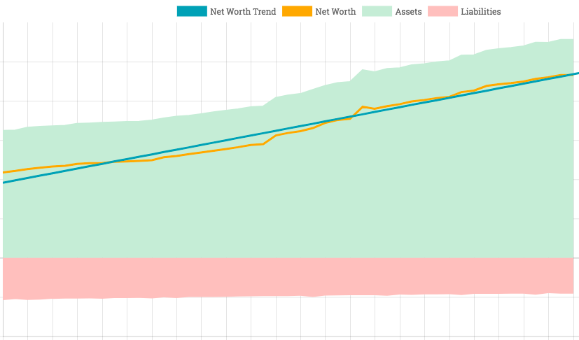
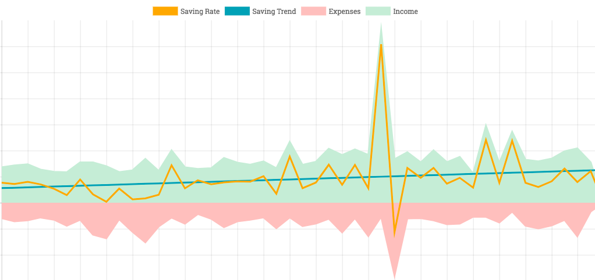

# Overview
This project contains code to parse a [Ledger](https://www.ledger-cli.org/)-formatted file and render the data as various charts.

# Screenshots
## Net Worth

Shows assets, liabilities, net worth (i.e. assets - liabilities), and a linear regression trend line over time.  (Axes omitted for privacy.)

## Saving Rate

Shows income, expenses, saving rate (i.e. income - expenses), and a linear regression trend line over time.  (Axes omitted for privacy.)

# Running the code
- Generate parsed data: `npm run-script parse`
  - translates [Ledger](https://www.ledger-cli.org/)-formatted file `accounts.dat` into `src/parsed.js` that provides the data to the charting code
- Start the server: `npm start`
- Run tests: `npm test`

# User Stories
## Net Worth
- As a *person managing their finances* I want to *know my net worth* so that I *feel incentivized to keep saving*.
- As a *person managing their finances* I want to *know the history of my net worth* so that I *can understand how it is growing and adjust my behavior if necessary*.
- As a *person managing their finances* I want to *see my net worth projected out for the next N years* so that I *can make plans based on it*.

## Saving Rate
- As a *person managing their finances* I want to *know how much I save every month (median over the last 12 months)* so that I *can plan*
- As a *person managing their finances* I want to *know how my saving rate is trending* so that I *can adjust/maintain my behavior*.

## Asset Breakdown
- As a *person thinking about their net worth* I want to *see a breakdown of my assets by type* so that I *understand the liquidity and risk inherent in my net worth*.
- Examples
  - This expensive wristwatch is worth N lunches
  - Remodeling the kitchen is equivalent to N months of mortgage payments

## Account History
- As a *person managing their finances* I want to *know how how much is spent in a particular way* so that I *can understand how my behavior has changed over time*.
- Examples
  - $ spent at restaurants vs. groceries
  - $ spent on vacation

## Relative Expenses
- As a *person contemplating a large expenditure* I want to *compare the expense against others* so that I *get a sense of tradeoffs and inherent value*.
- Examples
  - This expensive wristwatch is worth N lunches
  - Remodeling the kitchen is equivalent to N months of mortgage payments

## Financial Planner
- As a *person planning for financial life events* I want to *model them based on my accounting data and sensible defaults* so that I can *quickly see when and how much*.
- As a *person planning for financial life events* I want to *tweak the model and see how it changes as one variable or another changes* so that I can *explore implications and understand risks*.
- Examples
  - Real Estate (variables: mortgage size, $ available for down payment, APR, mortgage term)
  - Retirement (variables: investment return before and after retirement, retirement income, retirement date, retirement length)
  - Startup
  - Charitable Foundation
